项目管理工具
============

>   **maven**

>   **一、 回顾[理解]**

Maven 的好处
------------

>   节省磁盘空间 可以一键构建 可以跨平台

>   应用在大型项目时可以提高开发效率

安装配置 maven
--------------

>   注意：3.3+版本需要 jdkj.7+以上的支持

3. 三种仓库
-----------

>   本地仓库 远程仓库（私服） 中央仓库

4. 常见的命令
-------------

>   Compile Test Package Install Deploy Clean

5. 坐标的书写规范
-----------------

>   groupId 公司或组织域名的倒序 artifactId 项目名或模块名 version 版本号

6. 如何添加坐标
---------------

>   1、在本地仓库中搜索

>   2、互联网上搜，推荐网址 http://www.mvnrepository.com/

7. 依赖范围
-----------

>   Compile Test Runtime Provided

二、 maven 构建 SSM 工程[应用]
==============================

1. 需求
-------

实现 SSM 工程构建，规范依赖管理。场景：根据 id 展示商品信息

2. 准备数据库
-------------

导入以下语句

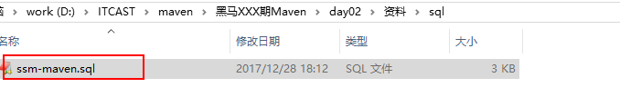

3. 创建一个 maven 工程
----------------------

1、新建一个 ssm_maven 项目,使用下图选中的骨架

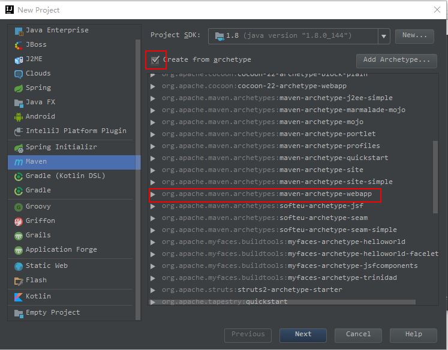

2、填写坐标

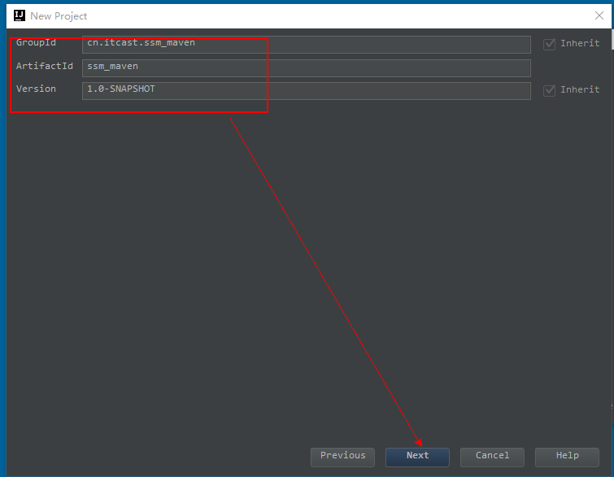

3、查看是否使用的自己的私服

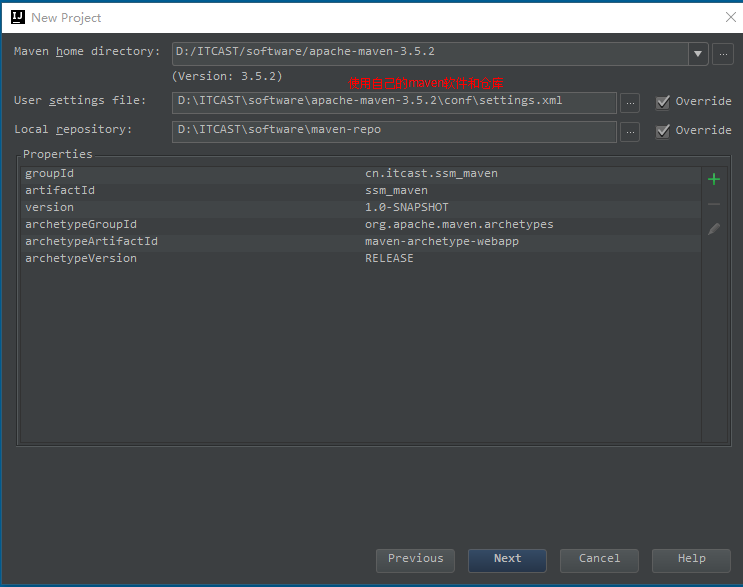

5、在 main 目录下新建 java 和 resources 文件夹

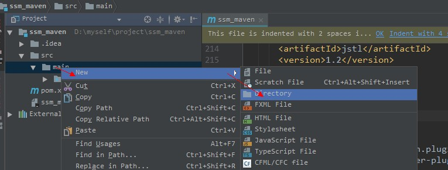

6、把 java 和 resources 文件夹转成 source root

 

7、修改编译版本，在 pom.xml 文件中添加

4. 知识点准备
-------------

>   **4.1 什么是依赖传递**

先添加 springmvc 的核心依赖的坐标

会发现出现除了 spring-webmvc 以外的其他 jar。因为我们的项目依赖
spring-webmv.jar，而 spring-webmv.jar 会依赖 spring-beans.jar 等等，所以
spring-beans.jar 这些 jar 包也出现在了我 们的 maven
工程中，这种现象我们称为依赖传递。从下图中可看到他们的关系：（请注意
spring-beans 的版本）

------------------------------------------

4.2 依赖冲突的解决

接着添加一个依赖

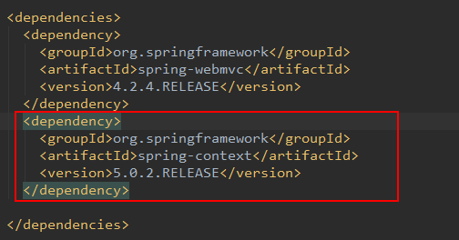

我们会发现这两个 jar 包同时都依赖了 spring-beans

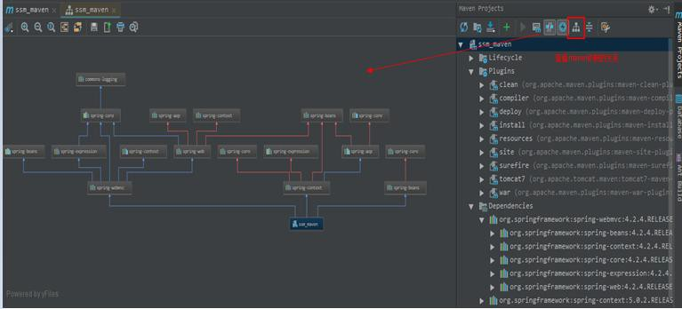

但是

spring-*webmvc* 依赖 spirng-beans-4.2.4，spring-context 依赖
spring-beans-5.0.2，但是发现 spirng-beans-4.2.4 加入到工程中

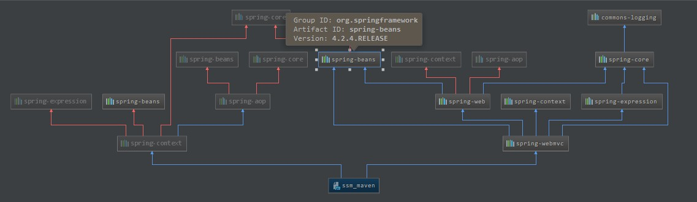

而我们希望 spring-beans-5.0.2
加入工程。这就造成了依赖冲突。解决依赖冲突有以下原则：

### 4.2.1 依赖调解原则

>   maven 自动按照下边的原则调解：

####  1、第一声明者优先原则

在 pom 文件定义依赖，先声明的依赖为准。 测试：

如果将上边 spring-webmvc 和 spring-context 顺序颠倒，系统将导入
spring-beans-5.0.2。 分析：

由于 spring-webmvc 在前边以 spring-webmvc 依赖的 spring-beans-5.0.2
为准，所以最终

spring-beans-5.0.2 添加到了工程中。

####  2、路径近者优先原则

例如：还是上述情况，spring-contex 和 spring-webmvc 都会传递过来 spirng-beans，那
如果直接把 spring-beans 的依赖直接写到 pom
文件中，那么项目就不会再使用其他依赖传 递来的 spring-beans，因为自己直接在 pom
中定义 spring-beans 要比其他依赖传递过来的路 径要近。

在本工程中的 pom 中加入 spirng-beans-5.0.2
的依赖，根据路径近者优先原则，系统将导入

spirng-beans-5.0.2：

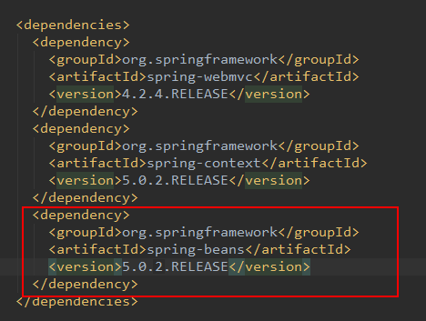

### 4.2.2 排除依赖

上边的问题也可以通过排除依赖方法辅助依赖调解，如下：

比如在依赖 spring-webmvc 的设置中添加排除依赖，排除 spring-beans，
下边的配置表示：依赖 spring-webmvc，但排除 spring-webmvc 所依赖的 spring-beans。

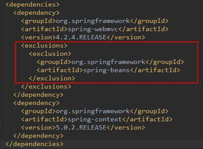

### 4.2.3 锁定版本

面对众多的依赖，有一种方法不用考虑依赖路径、声明优化等因素可以采用直接锁定版
本的方法确定依赖构件的版本，版本锁定后则不考虑依赖的声明顺序或依赖的路径，以锁定
的版本的为准添加到工程中，此方法在企业开发中常用。

如下的配置是锁定了 spring-beans 和 spring-context 的版本：

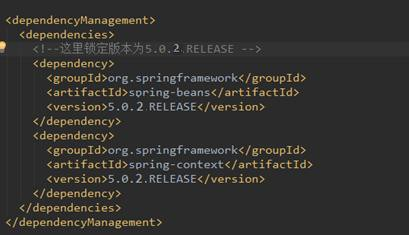

还可以把版本号提取出来，使用\<properties\>标签设置成变量。

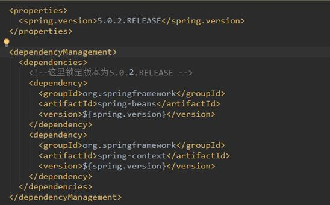

注意：在工程中锁定依赖的版本并不代表在工程中添加了依赖，如果工程需要添加锁定版本
的依赖则需要单独添加\<dependencies\>\</dependencies\>标签，如下：

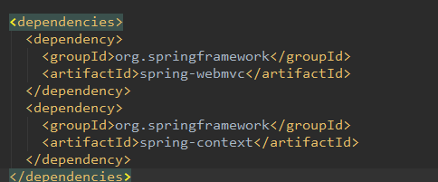

上边添加的依赖并没有指定版本，原因是已在\<dependencyManagement\>中锁定了版本，
所以在\<dependency\>下不需要再指定版本。

定义 pom.xml
------------

maven 工程首先要识别依赖，web 工程实现 SSM 整合，需要依赖 spring-webmvc5.0.2、
spring5.0.2、mybatis3.4.5 等，在 pom.xml 添加工程如下依赖：

（在实际企业开发中会有架构师专门来编写 pom.xml） 分两步：

1）锁定依赖版本

2）添加依赖

>   \<?xml version="1.0" encoding="UTF-8"?\>

>   \<project xmlns="http://maven.apache.org/POM/4.0.0"
>   xmlns:xsi="http://www.w3.org/2001/XMLSchema-[instance"](http://www.w3.org/2001/XMLSchema-instance)

>   xsi:schemaLocation="http://maven.apache.org/POM/4.0.0
>   [http://maven.apache.org/xsd/maven-4.0.0.xsd"](http://maven.apache.org/xsd/maven-4.0.0.xsd)\>

>   \<modelVersion\>4.0.0\</modelVersion\>

>   \<groupId\>cn.itcast.ssm_maven\</groupId\>

>   \<artifactId\>ssm_maven\</artifactId\>

>   \<version\>1.0-SNAPSHOT\</version\>

>   \<packaging\>war\</packaging\>

>   \<properties\>

>   \<spring.version\>5.0.2.RELEASE\</spring.version\>

>   \<springmvc.version\>5.0.2.RELEASE\</springmvc.version\>

>   \<mybatis.version\>3.4.5\</mybatis.version\>

>   \</properties\>

>   \<!--锁定依赖版本--\>

>   \<dependencyManagement\>

>   \<dependencies\>

>   \<!-- Mybatis --\>

>   \<dependency\>

>   \<groupId\>org.mybatis\</groupId\>

>   \<artifactId\>mybatis\</artifactId\>

>   \<version\>\${mybatis.version}\</version\>

>   \</dependency\>

>   \<!-- springMVC --\>

>   \<dependency\>

>   \<groupId\>org.springframework\</groupId\>

>   \<artifactId\>spring-webmvc\</artifactId\>

>   \<version\>\${springmvc.version}\</version\>

>   \</dependency\>

>   \<dependency\>

>   \<groupId\>org.springframework\</groupId\>

>   \<artifactId\>spring-context\</artifactId\>

>   \<version\>\${spring.version}\</version\>

>   \</dependency\>

>   \<!-- spring --\>

>   \<dependency\>

>   \<groupId\>org.springframework\</groupId\>

>   \<artifactId\>spring-core\</artifactId\>

 

>   \<version\>\${spring.version}\</version\>

>   \</dependency\>

>   \<dependency\>

>   \<groupId\>org.springframework\</groupId\>

>   \<artifactId\>spring-aop\</artifactId\>

>   \<version\>\${spring.version}\</version\>

>   \</dependency\>

>   \<dependency\>

>   \<groupId\>org.springframework\</groupId\>

>   \<artifactId\>spring-web\</artifactId\>

>   \<version\>\${spring.version}\</version\>

>   \</dependency\>

>   \<dependency\>

>   \<groupId\>org.springframework\</groupId\>

>   \<artifactId\>spring-expression\</artifactId\>

>   \<version\>\${spring.version}\</version\>

>   \</dependency\>

>   \<dependency\>

>   \<groupId\>org.springframework\</groupId\>

>   \<artifactId\>spring-beans\</artifactId\>

>   \<version\>\${spring.version}\</version\>

>   \</dependency\>

>   \<dependency\>

>   \<groupId\>org.springframework\</groupId\>

>   \<artifactId\>spring-aspects\</artifactId\>

>   \<version\>\${spring.version}\</version\>

>   \</dependency\>

>   \<dependency\>

>   \<groupId\>org.springframework\</groupId\>

>   \<artifactId\>spring-context-support\</artifactId\>

>   \<version\>\${spring.version}\</version\>

>   \</dependency\>

>   \<dependency\>

>   \<groupId\>org.springframework\</groupId\>

>   \<artifactId\>spring-test\</artifactId\>

>   \<version\>\${spring.version}\</version\>

>   \</dependency\>

>   \<dependency\>

>   \<groupId\>org.springframework\</groupId\>

>   \<artifactId\>spring-jdbc\</artifactId\>

 

 

 

------------------------------------------

Dao 层

在 src/main/java 中定义 dao 接口，实现根据 id 查询商品信息：

pojo 模型类
-----------

在 src/main/java 创建模型类

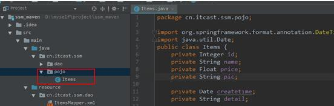

------------------------------------------

dao 层代码

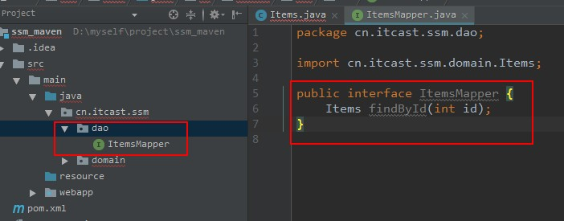

>   **6.3配置文件**

注意配置文件的位置

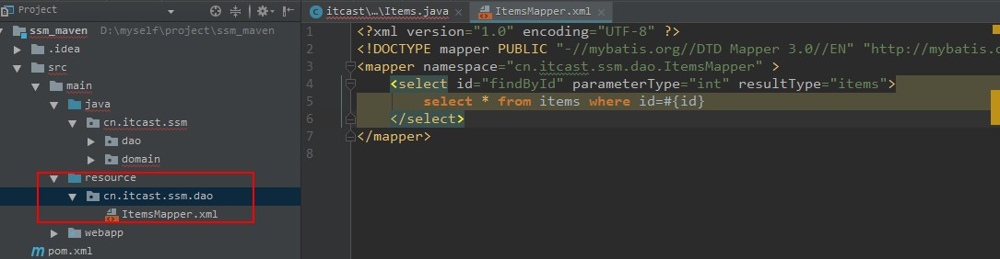

 内容如下

-   在 src/main/resources 创建 applicationContext.xml

 

>   <http://www.springframework.org/schema/context/spring-context-4.0.xsd
>   http://www.springframework.org/schema/aop>

<http://www.springframework.org/schema/aop/spring-aop-4.0.xsd
http://www.springframework.org/schema/tx
http://www.springframework.org/schema/tx/spring-tx-4.0.xsd>

<http://www.springframework.org/schema/util
http://www.springframework.org/schema/util/spring-util-4.0.xsd>"\>

>   \<!-- 数据库连接池 --\>

>   \<bean id="dataSource" class="com.alibaba.druid.pool.DruidDataSource"\>

>   \<!-- 驱动 --\>

>   \<property name="driverClassName" value="com.mysql.jdbc.Driver" /\>

>   \<!-- url --\>

>   \<property name="url" value="jdbc:mysql://localhost:3306/maven" /\>

>   \<!-- 用户名 --\>

>   \<property name="username" value="root" /\>

>   \<!-- 密码 --\>

>   \<property name="password" value="root" /\>

>   \</bean\>

>   \<!-- mapper 配置 --\>

>   \<!-- 让 spring 管理 sqlsessionfactory 使用 mybatis 和 spring 整合包中的
>   --\>

\<bean id="sqlSessionFactory" class="org.mybatis.spring.SqlSessionFactoryBean"\>

>   \<!-- 数据库连接池 --\>

>   \<property name="dataSource" ref="dataSource" /\>

\<property name="typeAliasesPackage" value="cn.itcast.ssm.pojo"\>\</property\>

>   \</bean\>

>   \<!-- mapper 扫描器 ：用来产生代理对象--\>

>   \<bean class="org.mybatis.spring.mapper.MapperScannerConfigurer"\>

>   \<property name="basePackage" value="cn.itcast.ssm.dao"\>\</property\>

>   \</bean\>

\</beans\>

-   在 src/main/resources 配置 log4j.properties

>   **6.4 单元测试**

在 src/test/java 创建单元测试类

Service 层
----------

>   **7.1代码**

>   **7.2配置文件**

在 applicationContext.xml 中配置 service

>   \<context:component-scan base-package="cn.itcast.ssm.service"/\>

1.  **Web 层**

>   **8.1代码**

>   **8.2配置文件**

-   在 springmvc.xml

 

>   Web.xml

加载 spring 容器，配置 springmvc 前端控制器

\<?xml version="1.0" encoding="UTF-8"?\>

\<web-app xmlns:xsi="<http://www.w3.org/2001/XMLSchema-instance>"
xmlns="<http://java.sun.com/xml/ns/javaee>"
xsi:schemaLocation="<http://java.sun.com/xml/ns/javaee
http://java.sun.com/xml/ns/javaee/web-app_2_5.xsd>" id="WebApp_ID"
version="2.5"\>

>   \<!-- 前端控制器 加载 springmvc 容器 --\>

>   \<servlet\>

>   \<servlet-name\>springmvc\</servlet-name\>

\<servlet-class\>org.springframework.web.servlet.DispatcherServlet\</servl
et-class\>

>   \<init-param\>

>   \<param-name\>contextConfigLocation\</param-name\>

>   \<param-value\>classpath:springmvc.xml\</param-value\>

>   \</init-param\>

>   \</servlet\>

>   \<servlet-mapping\>

>   \<servlet-name\>springmvc\</servlet-name\>

>   \<url-pattern\>\*.action\</url-pattern\>

>   \</servlet-mapping\>

>   \<!-- 监听器 加载 spring 容器 --\>

>   \<listener\>

\<listener-class\>org.springframework.web.context.ContextLoaderListener\</
listener-class\>

>   \</listener\>

>   \<context-param\>

>   \<param-name\>contextConfigLocation\</param-name\>

>   \<param-value\>classpath\*:applicationContext\*.xml\</param-value\>

>   \</context-param\>

\</web-app\>

Jsp
---

/WEB-INF/jsp/viewItem.jsp 如下：

| \<%\@ **page** language="java" contentType="text/html; charset=UTF-8" |             |                                           |            |     |   |
|-----------------------------------------------------------------------|-------------|-------------------------------------------|------------|-----|---|
| pageEncoding="UTF-8"%\>                                               |             |                                           |            |     |   |
| \<%\@                                                                 | **taglib**  | uri="<http://java.sun.com/jsp/jstl/core>" | prefix="c" | %\> |   |

 

\<%\@ **taglib** uri="<http://java.sun.com/jsp/jstl/fmt>" prefix="fmt"%\>

\<!DOCTYPE html PUBLIC "-//W3C//DTD HTML 4.01 Transitional//EN"
"<http://www.w3.org/TR/html4/loose.dtd>"\>

\<html\>

\<head\>

>   \<meta http-equiv="Content-Type" content="text/html; charset=UTF-8"\>

>   \<title\>商品信息\</title\>

\</head\>

\<body\>

\<form\>

>   \<table width="100%" border=1\>

>   \<tr\>

>   \<td\>商品名称\</td\>

>   \<td\> **\${**item.name **}** \</td\>

>   \</tr\>

>   \<tr\>

>   \<td\>商品价格\</td\>

>   \<td\> **\${**item.price **}** \</td\>

>   \</tr\>

>   \<tr\>

>   \<td\>生成日期\</td\>

>   \<td\> \<**fmt:formatDate** value="**\${**item.createtime**}**"

pattern="yyyy-MM-dd HH:mm:ss"/\> \</td\>

>   \</tr\>

>   \<tr\>

>   \<td\>商品简介\</td\>

>   \<td\>**\${**item.detail**}** \</textarea\>

>   \</td\>

>   \</tr\>

>   \</table\>

\</form\>

\</body\>

\</html\>

10. 运行与调试
--------------

添加 tomcat7 插件，双击右侧 tomcat7 运行

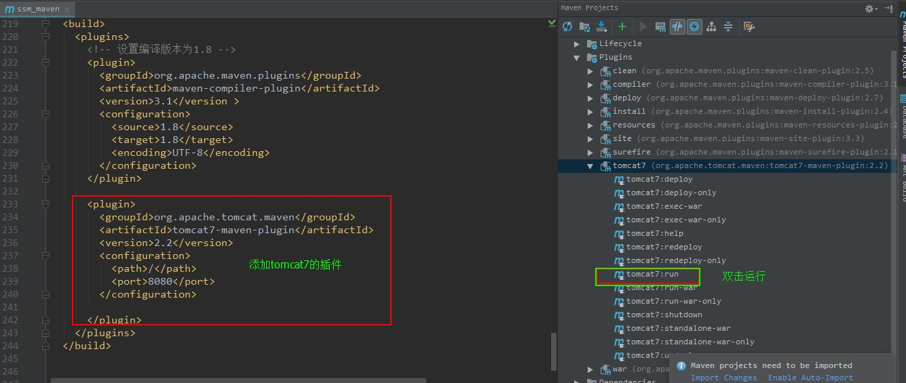

运行结果如下：

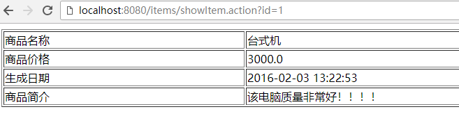

三、 分模块构建工程[应用]
=========================

基于上边的三个工程分析

继承：创建一个 parent 工程将所需的依赖都配置在 pom 中 聚合：聚合多个模块运行。

1. 需求 需求描述
----------------

将 SSM 工程拆分为多个模块开发：

ssm_dao ssm_service ssm_web

理解继承和聚合
--------------

通常继承和聚合同时使用。

 何为继承？

继承是为了消除重复，如果将 dao、service、web 分开创建独立的工程则每个工程的
pom.xml 文件中的内容存在重复，比如：设置编译版本、锁定 spring
的版本的等，可以将这些重复的 配置提取出来在父工程的 pom.xml 中定义。

 何为聚合？
项目开发通常是分组分模块开发，每个模块开发完成要运行整个工程需要将每个模块聚合在
一起运行，比如：dao、service、web 三个工程最终会打一个独立的 war 运行。

2. 案例实现
-----------

1.  **maven-parent 父模块**

### 2.1.1 创建父工程

1、选择骨架创建父工程

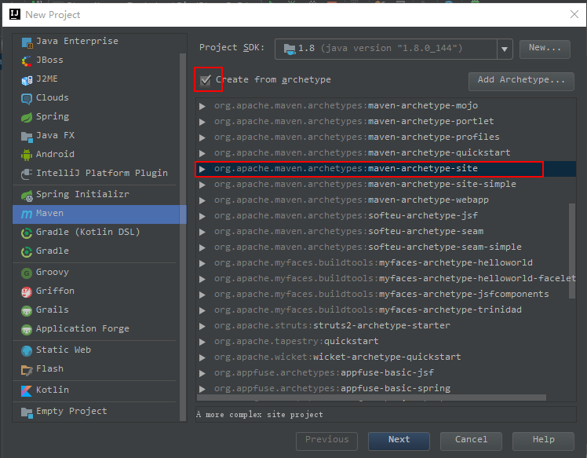

2、填写坐标

 

3、确认使用的是本地仓库

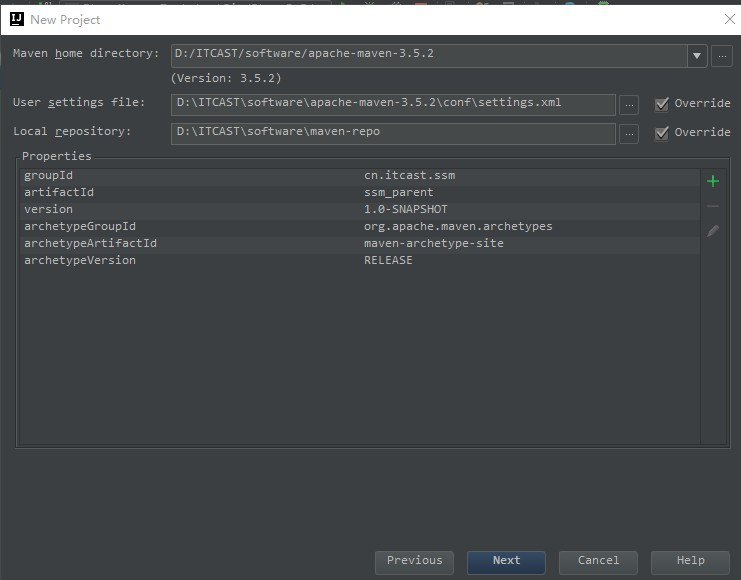

5、注意代码所在的路径（默认）

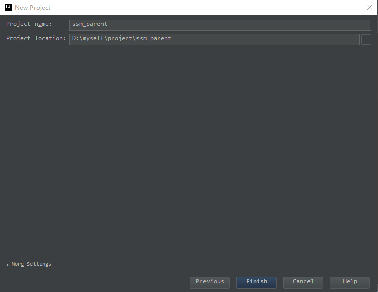

6、设置项目的打包方式

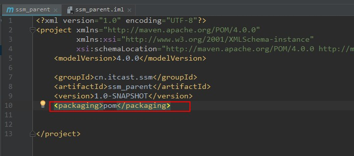

### 定义 pom.xml

在父工程的 pom.xml 中抽取一些重复的配置的，比如：锁定 jar
包的版本、设置编译版本等。

 

 

### 2.1.3 将父工程发布至仓库

父工程创建完成执行 install 将父工程发布到仓库方便子工程继承：

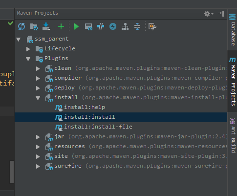

ssm_dao 子模块
--------------

### 2.2.1 创建 dao 子模块

1、在父工程上右击创建 maven 模块：

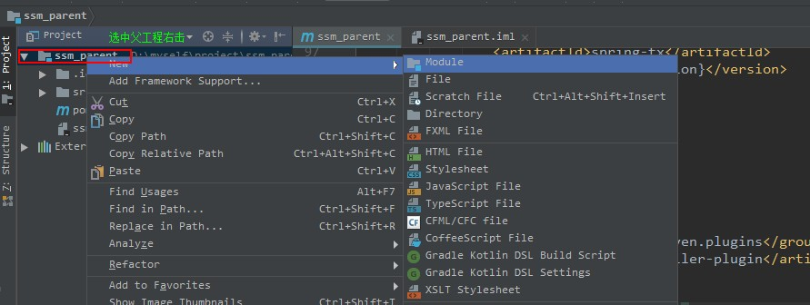

2、选择“跳过骨架选择”：

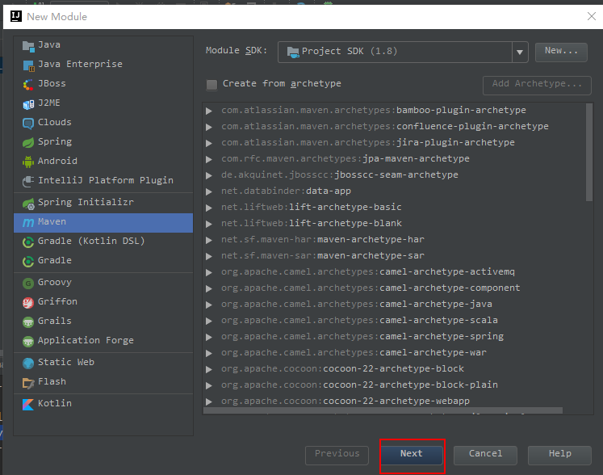

3、填写模块名称

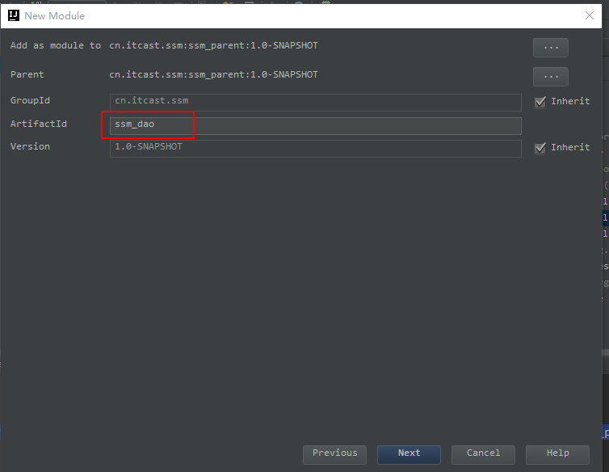

4、下一步，确定项目的目录

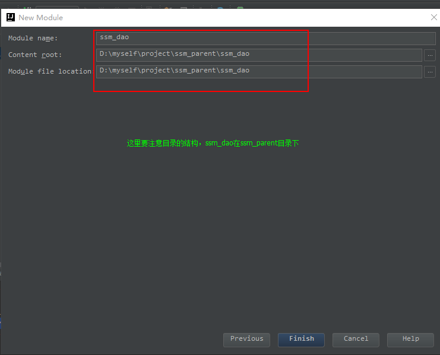

5、打包方式是 jar

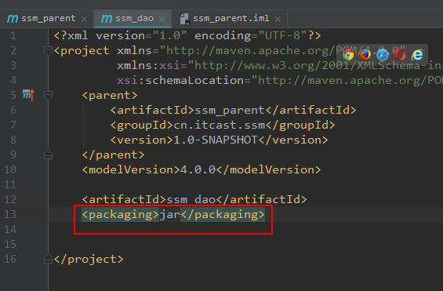

### 定义 pom.xml

只添加到层的 pom，mybatis 和 spring 的整合相关依赖

 

### 

dao 代码

把文件夹转成 sources root

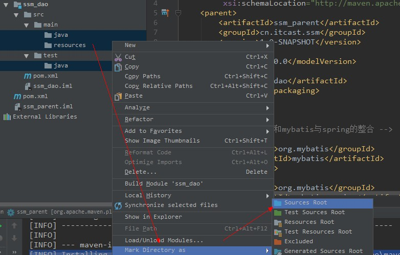

将 ssm_maven 工程中的 dao 接口、映射文件及 pojo 类拷贝到 src/main/java 中：

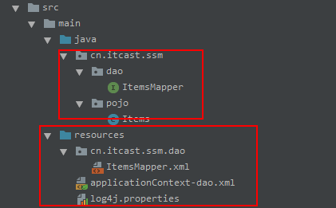

### 2.2.4 配置文件

将 applicationContext.xml 拆分出一个 applicationContext-dao.xml，此文件中只配置
dao 相关

 

\<?xml version="1.0" encoding="UTF-8"?\>

>   \<beans xmlns="<http://www.springframework.org/schema/beans>"
>   xmlns:context="<http://www.springframework.org/schema/context>"

>   xmlns:p="<http://www.springframework.org/schema/p>"
>   xmlns:aop="<http://www.springframework.org/schema/aop>"

>   xmlns:tx="<http://www.springframework.org/schema/tx>"
>   xmlns:xsi="<http://www.w3.org/2001/XMLSchema-instance>"
>   xsi:schemaLocation="<http://www.springframework.org/schema/beans>

>   <http://www.springframework.org/schema/beans/spring-beans-4.0.xsd
>   http://www.springframework.org/schema/context>

>   <http://www.springframework.org/schema/context/spring-context-4.0.xsd
>   http://www.springframework.org/schema/aop>

<http://www.springframework.org/schema/aop/spring-aop-4.0.xsd
http://www.springframework.org/schema/tx
http://www.springframework.org/schema/tx/spring-tx-4.0.xsd>

<http://www.springframework.org/schema/util
http://www.springframework.org/schema/util/spring-util-4.0.xsd>"\>

>   \<!-- 数据库连接池 --\>

>   \<bean id="dataSource" class="com.alibaba.druid.pool.DruidDataSource"\>

>   \<!-- 驱动 --\>

>   \<property name="driverClassName" value="com.mysql.jdbc.Driver" /\>

>   \<!-- url --\>

>   \<property name="url" value="jdbc:mysql://localhost:3306/maven" /\>

>   \<!-- 用户名 --\>

>   \<property name="username" value="root" /\>

>   \<!-- 密码 --\>

>   \<property name="password" value="root" /\>

>   \</bean\>

>   \<!-- mapper 配置 --\>

>   \<!-- 让 spring 管理 sqlsessionfactory 使用 mybatis 和 spring 整合包中的
>   --\>

\<bean id="sqlSessionFactory" class="org.mybatis.spring.SqlSessionFactoryBean"\>

>   \<!-- 数据库连接池 --\>

>   \<property name="dataSource" ref="dataSource" /\>

\<property name="typeAliasesPackage" value="cn.itcast.ssm.pojo"\>\</property\>

>   \</bean\>

>   \<!-- mapper 扫描器 ：用来产生代理对象--\>

>   \<bean class="org.mybatis.spring.mapper.MapperScannerConfigurer"\>

>   \<property name="basePackage" value="cn.itcast.ssm.dao"\>\</property\>

>   \</bean\>

\</beans\>

### 2.2.5 单元测试

1、首先在 dao 模块的 pom.xml 添加 junit 的依赖，添加时 Scope 选择 test

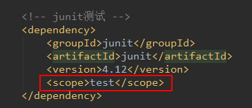

2、编写 junit 测试代码

### 2.2.6 把 dao 模块 install 到本地仓库

调过测试，install 到本地仓库

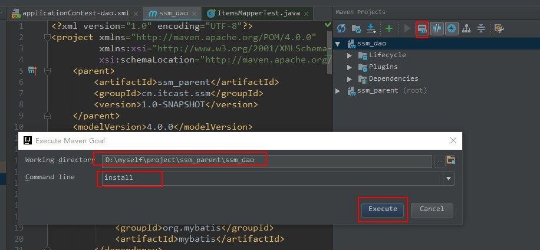

1.  ssm_service 子模块

    1.  创建 service 子模块

方法同 ssm_dao 模块创建方法，模块名称为 ssm_service。

### 定义 pom.xml

ssm_service 模块的 pom.xml 文件中需要继承父模块，ssm_service 依赖 ssm_dao
模块，添加

spring 相关的依赖：

### service 接口

将 ssm_maven 工程中的 service 接口拷贝到 src/main/java 中：

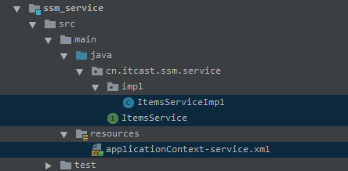

### 2.3.4 配置文件

创建 applicationContext-service.xml，此文件中定义的 service。

>   **2.3.5 依赖范围对传递依赖的影响（了解）**

>   **2.3.5.1 问题描述**

当在写 junit 测试时发现，代码报出没有找不到类的错误信息：

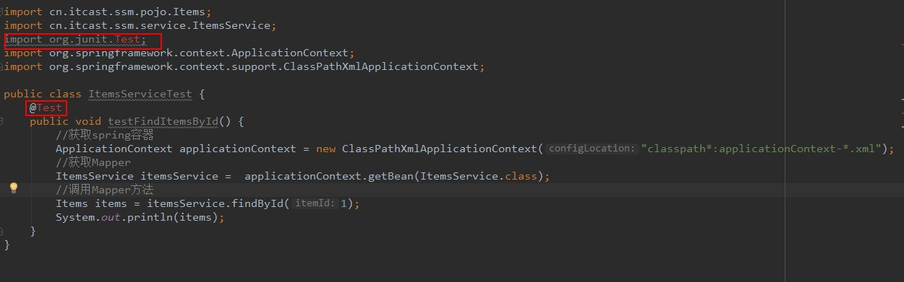

是因为没有 junit.jar 引起的!为什么会这样呢？我们 ssm_dao 模块中有 junit 依赖而

ssm_service 模块依赖了 ssm_dao，难道 junit 不应该传递过来吗？

### 2.3.5.3 依赖范围对传递依赖的影响

是因为依赖会有依赖范围，依赖范围对传递依赖也有影响，例如有 A、B、C，A 依赖 B、B

依赖 C，C 可能是 A 的传递依赖，如下图：

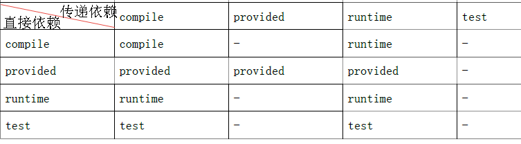

>   最左边一列为直接依赖，理解为 A 依赖 B 的范围，最顶层一行为传递依赖，理解为 B

依赖 C 的范围，行与列的交叉即为 A 传递依赖 C 的范围。

举例 1：

比如 A 对 B 有 compile 依赖，B 对 C 有 runtime 依赖，那么根据表格所示 A 对 C 有

runtime 依赖。

ssm_dao 依赖 junit，scop 为 test ssm_service 依赖 ssm_dao.
查看下图红色框内所示传递依赖范围：

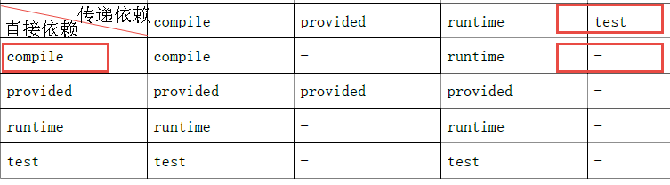

所以 ssm_dao 工程所依赖的 junit 的 jar 没有加入到 ssm_service 工程。

举例 2：如果修改 ssm_dao 工程依赖 junit 的 scop 为 compile，ssm_dao 工程所依赖的
junit

的 jar 包会加入到 ssm_service 工程中，符合上边表格所示，查看下图红色框内所示：

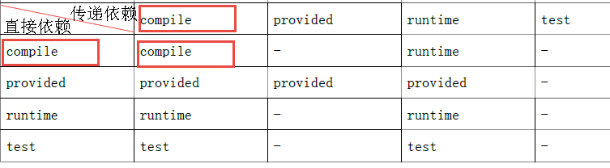

### 2.3.6 单元测试

遇到依赖没有传递过来的问题我们通常的解决方案是在本工程中直接添加依赖：
把如下依赖添加到 ssm_service 的工程中：

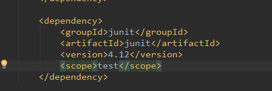

再看测试代码也不报错了

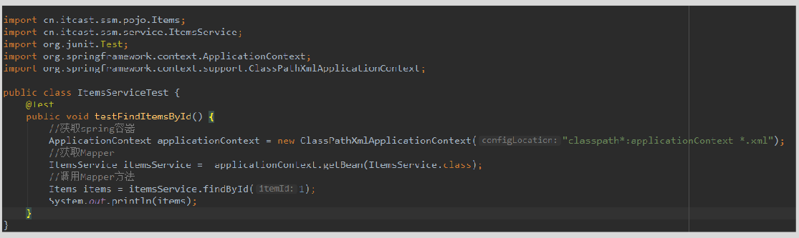

### 2.3.7 Install 到本地仓库

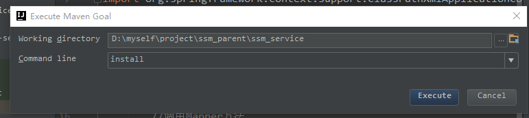

1.  **ssm_web 子模块**

>   **2.4.1 创建 web 子模块**

1、选择骨架创建 web 子模块

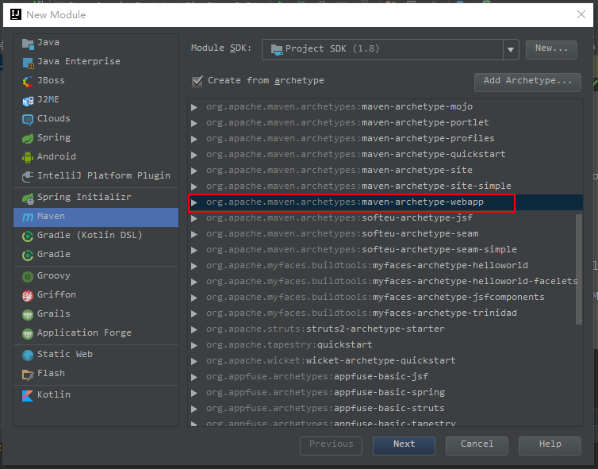

2、确认使用自己的本地仓库

 

3、填写模块名称

#### 

使用骨架创建 web 项目会花费些时间，请耐心等待

4、创建 java 和 resources 文件夹，转成 source root

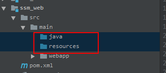

5、添加打包方式 war

 

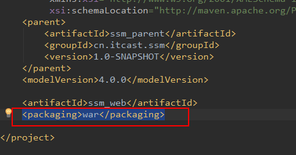

### 定义 pom.xml

ssm_web 模块的 pom.xml 文件中需要继承父模块，ssm_web 依赖 ssm_service 模块,和
springmvc 的依赖

### 

controller

将 ssm_web 工程中的 controller 代码拷贝到 src/main/java 中：

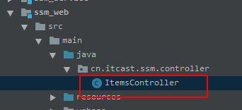

### 2.4.4 配置文件

拷贝 ssm_web 工程中如下配置文件：

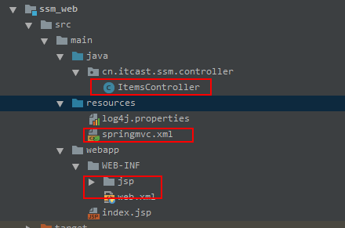

2.5 运行调试
------------

方法 1：在 ssm_web 工程的 pom.xml 中配置 tomcat 插件运行

运行 ssm_web 工程它会从本地仓库下载依赖的 jar 包，所以当 ssm_web 依赖的 jar
包内容修 改了必须及时发布到本地仓库，比如：ssm_web 依赖的 ssm_service
修改了，需要及时将

 

ssm_service 发布到本地仓库。

方法 2：在父工程的 pom.xml 中配置 tomcat 插件运行，自动聚合并执行

推荐方法 2，如果子工程都在本地，采用方法 2
则不需要子工程修改就立即发布到本地仓库， 父工程会自动聚合并使用最新代码执行。

注意：如果子工程和父工程中都配置了 tomcat 插件，运行的端口和路径以子工程为准。

3. 分模块构建工程-依赖整合
--------------------------

每个模块都需要 spring 或者 junit 的 jar，况且最终 package
打完包最后生成的项目中的 jar
就是各个模块依赖的整合，所以我们可以把项目中所需的依赖都可以放到父工程中,模块
中只留模块和模块之间的依赖，那父工程的 pom.xml 可以如下配置：

 

 

 

==========================================

四、 maven 私服[了解]

1. 需求
-------

正式开发，不同的项目组开发不同的工程。

ssm_dao 工程开发完毕，发布到私服。

ssm_service 从私服下载 dao

2. 分析
-------

公司在自己的局域网内搭建自己的远程仓库服务器，称为私服，私服服务器即是公司内
部的 maven 远程仓库，每个员工的电脑上安装 maven 软件并且连接私服服务器，员工将自
己开发的项目打成 jar 并发布到私服服务器，其它项目组从私服服务器下载所依赖的构件

（jar）。

私服还充当一个代理服务器，当私服上没有 jar 包会从互联网中央仓库自动下载，如下
图：

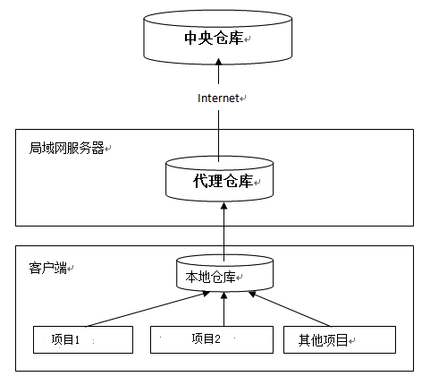

3. 搭建私服环境
---------------

1.  **下载 nexus**

Nexus 是 Maven 仓库管理器，通过 nexus 可以搭建 maven 仓库，同时 nexus 还提供强
大的仓库管理功能，构件搜索功能等。

>   下载 Nexus， 下载地址：<http://www.sonatype.org/nexus/archived/>

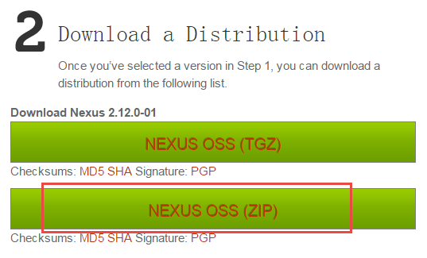

下载：nexus-2.12.0-01-bundle.zip

安装 nexus
----------

解压 nexus-2.12.0-01-bundle.zip，本教程将它解压在 F 盘，进入 bin 目录：

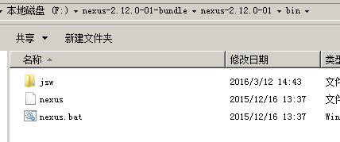

cmd 进入 bin 目录，执行 nexus.bat install

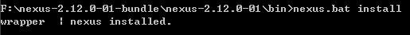

安装成功在服务中查看有 nexus 服务：

卸载 nexus
----------

cmd 进入 nexus 的 bin 目录，执行：nexus.bat uninstall

查看 window 服务列表 nexus 已被删除。

启动 nexus
----------

方法 1：

>   cmd 进入 bin 目录，执行 nexus.bat start

方法 2：

>   直接启动 nexus 服务

查看 nexus 的配置文件 conf/nexus.properties

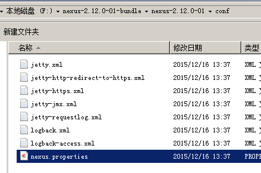

\# Jetty section

application-port=8081 \# nexus 的访问端口配置 application-host=0.0.0.0 \# nexus
主机监听配置(不用修改) nexus-webapp=\${bundleBasedir}/nexus \# nexus 工程目录
nexus-webapp-context-path=/nexus \# nexus 的 web 访问路径

\# Nexus section

nexus-work=\${bundleBasedir}/../sonatype-work/nexus \# nexus 仓库目录

runtime=\${bundleBasedir}/nexus/WEB-INF \# nexus 运行程序目录

访问：

http://localhost:8081/nexus/

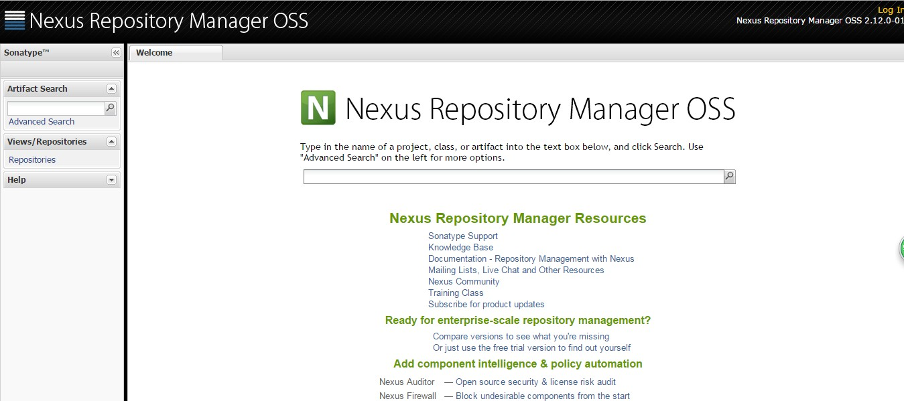

使用 Nexus 内置账户 admin/admin123 登陆： 点击右上角的 Log in，输入账号和密码
登陆

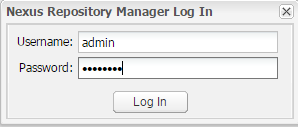

登陆成功：

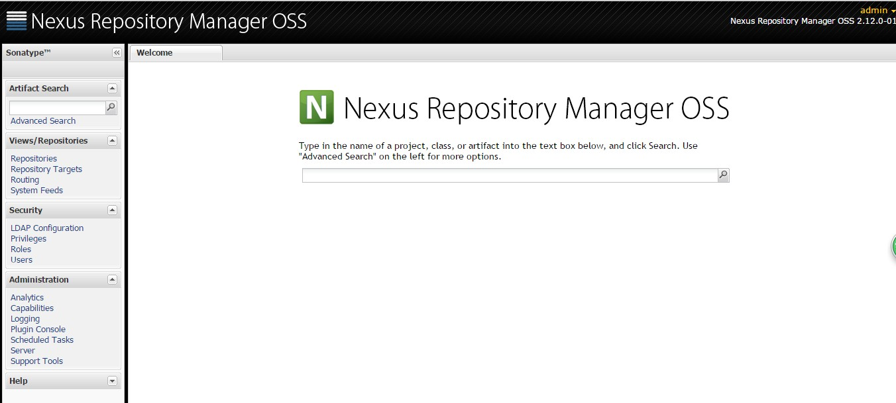

3.5 仓库类型
------------

nexus

查看 nexus 的仓库：

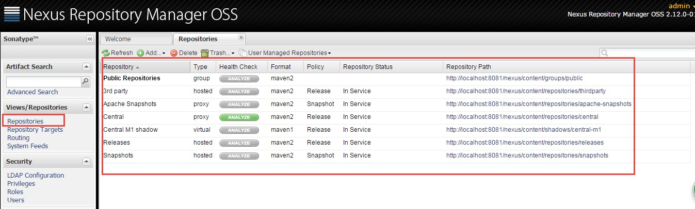

nexus 的仓库有 4 种类型：

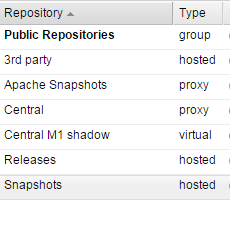

>   1. hosted，宿主仓库，部署自己的 jar 到这个类型的仓库，包括 releases 和
>   snapshot 两部 分，Releases 公司内部发布版本仓库、 Snapshots
>   公司内部测试版本仓库

>   2. proxy，代理仓库，用于代理远程的公共仓库，如 maven
>   中央仓库，用户连接私服，私 服自动去中央仓库下载 jar 包或者插件。

>   3. group，仓库组，用来合并多个 hosted/proxy 仓库，通常我们配置自己的 maven
>   连接仓 库组。

4. virtual(虚拟)：兼容 Maven1 版本的 jar 或者插件

nexus 仓库默认在 sonatype-work 目录中：

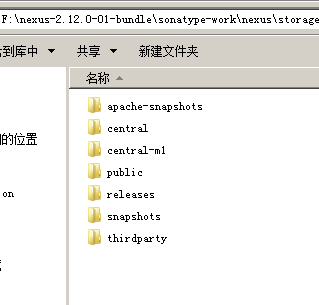

####  central：代理仓库，代理中央仓库

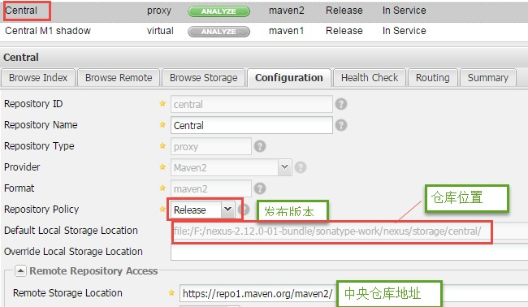

-   **apache-snapshots：代理仓库**

存储 snapshots 构件，代理地址 https://repository.apache.org/snapshots/

-   **central-m1：**virtual 类型仓库，兼容 Maven1 版本的 jar 或者插件

-   releases：本地仓库，存储 releases 构件。

-   **snapshots：本地仓库，存储 snapshots 构件。**

-   **thirdparty：第三方仓库**

-   **public：仓库组**

>   **4. 将项目发布到私服**

>   **4.1 需求**

企业中多个团队协作开发通常会将一些公用的组件、开发模块等发布到私服供其它团队
或模块开发人员使用。

本例子假设多团队分别开发 ssm_dao、ssm_service、ssm_web，某个团队开发完在 ssm_dao
会将 ssm_dao 发布到私服供 ssm_service 团队使用，本例子会将 ssm_dao 工程打成 jar
包发布到私服。

4.2 配置
--------

>   第一步：需要在客户端即部署 ssm_dao 工程的电脑上配置 maven 环境，并**修改
>   settings.xml**

文件，配置连接私服的用户和密码 。
此用户名和密码用于私服校验，因为私服需要知道上传的账号和密码是否和私服中的账号和
密码一致。

>   \<server\>

>   \<id\>releases\</id\>

>   \<username\>admin\</username\>

>   \<password\>admin123\</password\>

>   \</server\>

>   \<server\>

>   \<id\>snapshots\</id\>

>   \<username\>admin\</username\>

>   \<password\>admin123\</password\>

>   \</server\>

releases 连接发布版本项目仓库

snapshots 连接测试版本项目仓库

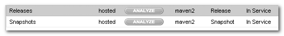

第二步： 配置项目 pom.xml

配置私服仓库的地址，本公司的自己的 jar
包会上传到私服的宿主仓库，根据工程的版本号 决定上传到哪个宿主仓库，如果版本为
release 则上传到私服的 release 仓库，如果版本为 snapshot 则上传到私服的 snapshot
仓库

注意：pom.xml 这里\<id\> 和 settings.xml 配置 \<id\> 对应！

4.3 测试
--------

将项目 dao 工程打成 jar 包发布到私服：

1、首先启动 nexus

2、对 ssm_dao 工程执行 deploy 命令

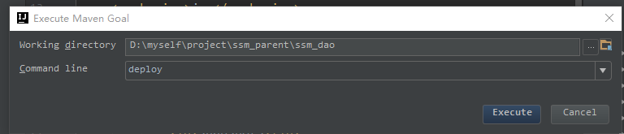

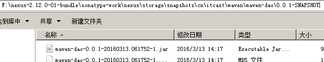

根据本项目pom.xml中version定义决定发布到哪个仓库，如果 version定义为 snapshot，
执行 deploy 后查看 nexus 的 snapshot 仓库，如果 version 定义为 release
则项目将发布到 nexus 的 release 仓库，本项目将发布到 snapshot 仓库：

也可以通过 http 方式查看：

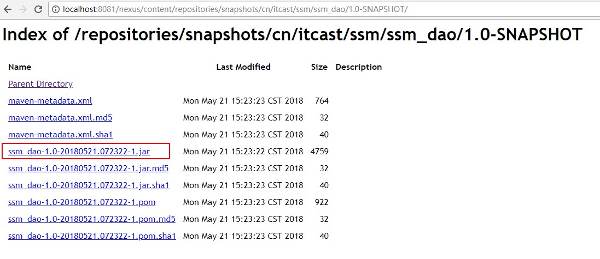

5. 从私服下载 jar 包
--------------------

>   **5.1 需求**

没有配置 nexus 之前，如果本地仓库没有，去中央仓库下载，通常在企业中会在局域网
内部署一台私服服务器，有了私服本地项目首先去本地仓库找 jar，如果没有找到则连接私
服从私服下载 jar 包，如果私服没有 jar 包私服同时作为代理服务器从中央仓库下载 jar
包， 这样做的好处是一方面由私服对公司项目的依赖 jar
包统一管理，一方面提高下载速度，项 目连接私服下载 jar
包的速度要比项目连接中央仓库的速度快的多。

>   本例子测试从私服下载 ssm_dao 工程 jar 包。

5.2 管理仓库组
--------------

nexus中包括很多仓库，hosted 中存放的是企业自己发布的jar包及第三方公司的 jar包，
proxy 中存放的是中央仓库的 jar，为了方便从私服下载 jar
包可以将多个仓库组成一个仓库 组，每个工程需要连接私服的仓库组下载 jar 包。

打开 nexus 配置仓库组，如下图：

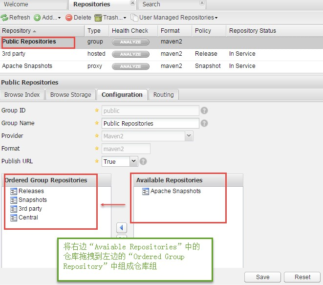

上图中仓库组包括了本地仓库、代理仓库等。

5.3 在 setting.xml 中配置仓库
-----------------------------

在客户端的 setting.xml 中配置私服的仓库，由于 setting.xml 中没有 repositories
的配置 标签需要使用 profile 定义仓库。

 

使用 profile 定义仓库需要激活才可生效。

配置成功后通过 eclipse 查看有效 pom，有效 pom 是 maven 软件最终使用的 pom
内容，程 序员不直接编辑有效 pom，打开有效 pom

 

有效 pom 内容如下：

下边的 pom 内容中有两个仓库地址，maven 会先从前边的仓库的找，如果找不到 jar
包再从 下边的找，从而就实现了从私服下载 jar 包。

------------------------------------------

5.4 测试从私服下载 jar 包

测试 1：局域网环境或本地网络即可

在 ssm_service 工程中添加以上配置后，添加 ssm_dao 工程的依赖，删除本地仓库中
ssm_dao

工程，同时在 eclipse 中关闭 ssm_dao 工程。 观察控制台：

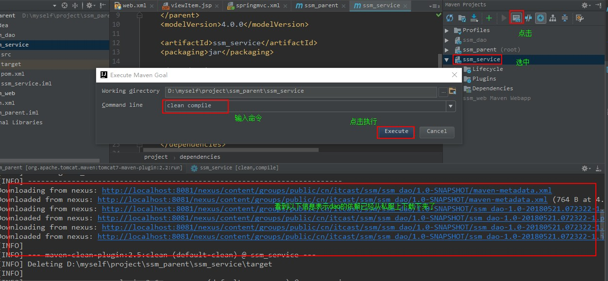

项目先从本地仓库找 ssm_dao，找不到从私服找，由于之前执行 deploy 将 ssm_dao
部署到 私服中，所以成功从私服下载 ssm_dao 并在本地仓库保存一份。

如果此时删除私服中的 ssm_dao，执行 update project 之后是否正常？
如果将本地仓库的 ssm_dao 和私服的 ssm_dao 全部删除是否正常？ 测试
2：需要互联网环境

在项目的 pom.xml 添加一个依赖，此依赖在本地仓库和私服都不存在，maven 会先从本
地仓库找，本地仓库没有再从私服找，私服没有再去中央仓库下载，jar
包下载成功在私服、 本地仓库分别存储一份。

五、 把第三方 jar 包放入本地仓库或私服
======================================

1. 导入本地库
-------------

#### 随便找一个 jar 包测试，可以先 CMD 进入到 jar 包所在位置，运行

>   mvn install:install-file -DgroupId=com.alibaba -DartifactId=fastjson
>   -Dversion=1.1.37

>   \-Dfile= fastjson-1.1.37.jar -Dpackaging=jar

 

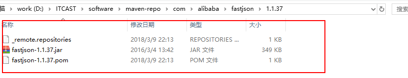

2. 导入私服
-----------

需要在 maven 软件的核心配置文件 settings.xml 中配置第三方仓库的 server 信息

>   \<server\>

>   \<id\>thirdparty\</id\>

>   \<username\>admin\</username\>

>   \<password\>admin123\</password\>

>   \</server\>

才能执行一下命令

>   mvn deploy:deploy-file -DgroupId=com.alibaba -DartifactId=fastjson
>   -Dversion=1.1.37

>   \-Dpackaging=jar -Dfile=fastjson-1.1.37.jar

>   \-Durl=http://localhost:8081/nexus/content/repositories/thirdparty/

>   \-DrepositoryId=thirdparty

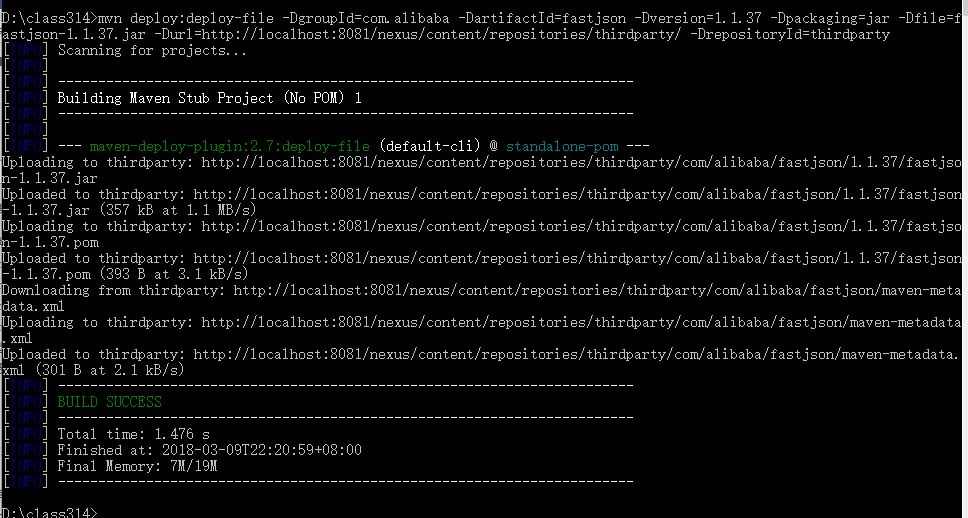

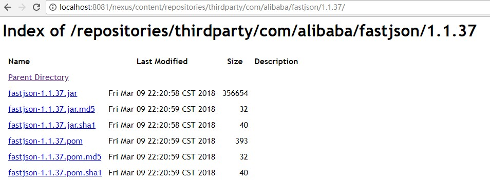

3. 参数说明
-----------

DgroupId 和 DartifactId 构成了该 jar 包在 pom.xml
的坐标，项目就是依靠这两个属性定位。 自己起名字也行。

Dfile 表示需要上传的 jar 包的绝对路径。

Durl 私服上仓库的位置，打开 nexus——\>repositories 菜单，可以看到该路径。

DrepositoryId 服务器的表示 id，在 nexus 的 configuration 可以看到。

Dversion 表示版本信息，

>   关于 jar 包准确的版本：
>   包的名字上一般会带版本号，如果没有那可以解压该包，会发现一个叫 MANIFEST.MF
>   的文件，

>   这个文件就有描述该包的版本信息。

>   比如 Specification-Version: 2.2 可以知道该包的版本了。 上传成功后，在 nexus
>   界面点击 3rd party 仓库可以看到这包。
