>   **Maven 基础课程第一天**

>   **第1章 Maven 介绍**

>   **1.1 什么是 Maven**

**1.1.1 什么是 Maven**

Maven 的正确发音是[ ˈmevən] ，而不是“马瘟”以及其他什么瘟。Maven
在美国是一个口语化的词 语，代表专家、内行的意思。

一个对 Maven 比较正式的定义是这么说的：Maven
是一个项目管理工具，它包含了一个**项目对象模 型** (**POM**：**Project Object
Model**)，一组标准集合，一个项目生命周期(Project Lifecycle)，一个依赖管
理系统(Dependency Management System) ，和用来运行定义在生命周期阶段(phase)
中插件(plugin)目标 (goal)的逻辑。

**1.1.2 Maven 能解决什么问题**

可以用更通俗的方式来说明。我们知道，项目开发不仅仅是写写代码而已，期间会伴随着各种
必不可少的事情要做，下面列举几个感受一下：

1.  我们需要引用各种 jar 包，尤其是比较大的工程，引用的 jar
    包往往有几十个乃至上百个， 每用 到一种 jar
    包，都需要手动引入工程目录，而且经常遇到各种让人抓狂的 jar
    包冲突，版本冲突。

2.  我们辛辛苦苦写好了 Java 文件，可是只懂 0 和 1
    的白痴电脑却完全读不懂，需要将它编译成二
    进制字节码。好歹现在这项工作可以由各种集成开发工具帮我们完成， Eclipse、IDEA
    等都可以将代
    码即时编译。当然，如果你嫌生命漫长，何不铺张，也可以用记事本来敲代码，然后用
    javac 命令一 个个地去编译，逗电脑玩。

3.  世界上没有不存在 bug 的代码，计算机喜欢 bug
    就和人们总是喜欢美女帅哥一样。为了追求美为 了减少
    bug，因此写完了代码，我们还要写一些单元测试，然后一个个的运行来检验代码质量。

4.  再优雅的代码也是要出来卖的。我们后面还需要把代码与各种配置文件、资源整合到一起，定型
    打包，如果是 web 项目，还需要将之发布到服务器，供人蹂躏。

试想，如果现在有一种工具，可以把你从上面的繁琐工作中解放出来，能帮你构建工程，管理
jar
包，编译代码，还能帮你自动运行单元测试，打包，生成报表，甚至能帮你部署项目，生成
Web 站 点，你会心动吗？Maven 就可以解决上面所提到的这些问题。

​     

**1.1.3 Maven 的优势举例**

前面我们通过 Web 阶段项目，要能够将项目运行起来，就必须将该项目所依赖的一些 jar
包添加到
工程中，否则项目就不能运行。试想如果具有相同架构的项目有十个，那么我们就需要将这一份
jar 包复制到十个不同的工程中。我们一起来看一个 CRM 项目

原因主要是因为上面的 WEB 程序要运行，我们必须将项目运行所需的 Jar
包复制到工程目录中，从 而导致了工程很大。

同样的项目，如果我们使用 Maven 工程来构建，会发现总体上工程的大小会少很多

小结：可以初步推断它里面一定没有 jar 包，继续思考，没有 jar
包的项目怎么可能运行呢？

>   **1.2 Maven 的两个精典作用**

**1.2.1 Maven 的依赖管理**

Maven
的一个核心特性就是依赖管理。当我们涉及到多模块的项目（包含成百个模块或者子项目
），管理依赖就变成 一项困难的任务。Maven 展示出了它对处理这种情形的高度控制。

传统的 WEB 项目中，我们必须将工程所依赖的 jar
包复制到工程中，导致了工程的变得很大。那么 maven 工程是如何使得工程变得很少呢？

分析如下：

通过分析发现：maven 工程中不直接将 jar 包导入到工程中，而是通过在 pom.xml
文件中添加所需 jar 包的坐标，这样就很好的避免了 jar 直接引入进来，在需要用到 jar
包的时候，只要查找 pom.xml 文 件，再通过 pom.xml
文件中的坐标，到一个专门用于”存放 jar 包的仓库” (maven 仓库)中根据坐标从
而找到这些 jar 包，再把这些 jar 包拿去运行。

那么问题来了

第一：”存放 jar 包的仓库” 长什么样？

第二：通过读取 pom.xml 文件中的坐标，再到仓库中找到 jar
包，会不会很慢？从而导致这种方式 不可行！

第一个问题：存放 jar
包的仓库长什么样，这一点我们后期会分析仓库的分类，也会带大家去看我们
的本地的仓库长什么样。

第二个问题：通过 pom.xml 文件配置要引入的 jar 包的坐标，再读取坐标并到仓库中加载
jar 包，这 样我们就可以直接使用 jar 包了，为了解决这个过程中速度慢的问题，maven
中也有索引的概念，通 过建立索引，可以大大提高加载 jar 包的速度，使得我们认为 jar
包基本跟放在本地的工程文件中再
读取出来的速度是一样的。这个过程就好比我们查阅字典时，为了能够加快查找到内容，书前面的
目录就好比是索引，有了这个目录我们就可以方便找到内容了，一样的 在 maven
仓库中有了索引我 们就可以认为可以快速找到 jar 包。

>      

​    

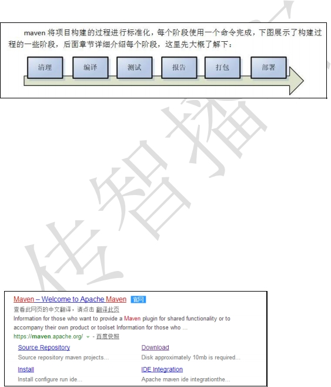

**1.2.2 项目的一键构 建**

>   我们的项目，往往都要经历编译、测试、运行、打包、安装 ，部署等一系列过程。

什么是构建？

指的是项目从编译、测试、运行、打包、安装 ，部署整个过程都交给 maven
进行管理，这个 过程称为构建。

一键构建

>   指的是整个构建过程，使用 maven 一个命令可以轻松完成整个工作。

Maven 规范化构建流程如下：

我们一起来看 Hello-Maven 工程的一键运行的过程。通过 tomcat:run
的这个命令，我们发现现在的 工程编译，测试，运行都变得非常简单。

>   **第2章 Maven 的使用**

>   **2.1 Maven 的安装**

**2.1.1 Maven 软件的下载**

>   为了使用 Maven
>   管理工具，我们首先要到官网去下载它的安装软件。通过百度搜索“Maven “如下：

>   点击 Download 链接，就可以直接进入到 Maven 软件的下载页面：

​                     

目前最新版是 apache-maven-3.5.3 版本，我们当时使用的是 apache-maven-3.5.2
版本，大家也可以下 载最新版本。

Apache-maven-3.5.2 下载地址：[http://archive.apache.org/dist/maven/maven-3/
](http://archive.apache.org/dist/maven/maven-3/)

下载后的版本如下:

**2.1.2 Maven 软件的安装**

Maven 下载后，将 Maven 解压到一个没有中文没有空格的路径下，比如
D:\\software\\maven 下面。 解压后目录结构如下：

bin:存放了 maven 的命令，比如我们前面用到的 mvn tomcat:run

1.  : 存放了一些 maven 本身的引导程序，如类加载器等

2.  :存放了 maven 的一些配置文件，如 setting.xml 文件

lib: 存放了 maven 本身运行所需的一些 jar 包

至此我们的 maven 软件就可以使用了，前提是你的电脑上之前已经安装并配置好了 JDK。
**2.1.3 JDK 的 准 备及 统一**

>   本次课程我们所使用工具软件的统一，JDK 使用 JDK8 版本

1. JDK 环境:

>      

​    

​                     

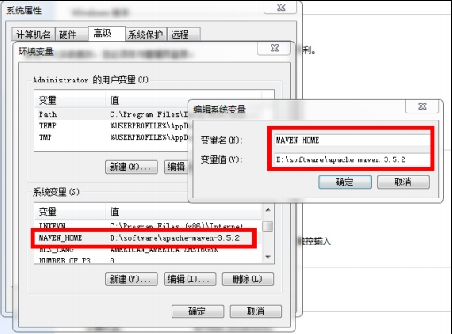

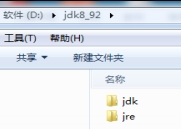

​                     

**2.1.4 Maven 及 JDK 配置**

电脑上需安装 java 环境，安装 JDK1.7 + 版本 （将 JAVA_HOME/bin 配置环境变量 path
），我们使 用的是 JDK8 相关版本

配置 MAVEN_HOME ，变量值就是你的 maven 安装 的路径（bin 目录之前一级目录）

上面配置了我们的 Maven 软件，注意这个目录就是之前你解压 maven
的压缩文件包在的的目录，最 好不要有中文和空格。

再次检查 JDK 的安装目录，如下图：

>      

​    

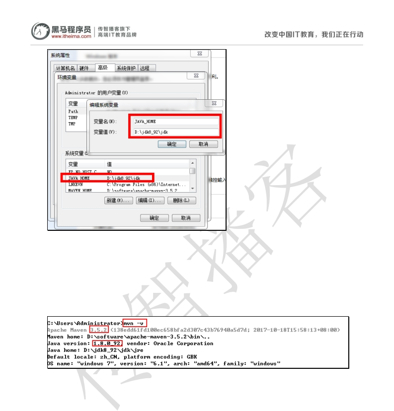

​                     

**2.1.5 Maven 软件版本测试**

通过 mvn -v 命令检查 maven 是否安装成功，看到 maven 的版本为 3.5.2 及 java
版本为 1.8 即为安装 成功。

找开 cmd 命令，输入 mvn –v 命令，如下图：

我们发现 maven 的版本，及 jdk 的版本符合要求，这样我们的 maven
软件安装就成功了。

>   **2.2 Maven 仓库**

**2.2.1 Maven 仓库的分类**

maven 的工作需要从仓库下载一些 jar 包，如下图所示，本地的项目 A、项目 B
等都会通过 maven 软件从远程仓库（可以理解为互联网上的仓库）下载 jar
包并存在本地仓库，本地仓库 就是本地文 件夹，当第二次需要此 jar
包时则不再从远程仓库下载，因为本地仓库已经存在了，可以将本地仓库
理解为缓存，有了本地仓库就不用每次从远程仓库下载了。

>      

​    

​                     

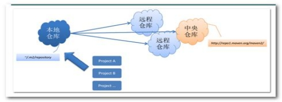

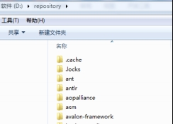

​                     

下图描述了 maven 中仓库的类型：



本地仓库 ：用来存储从远程仓库或中央仓库下载的插件和 jar 包，项目使用一些插件或
jar 包， 优先从本地仓库查找

默认本地仓库位置在 \${user.dir}/.m2/repository，\${user.dir} 表示 windows
用户目录。

远程仓库：如果本地需要插件或者 jar 包，本地仓库没有，默认去远程仓库下载。

远程仓库可以在互联网内也可以在局域网内。

中央仓库 ：在 maven 软件中内置一个远程仓库地址 <http://repo1.maven.org/maven2>
，它是中 央仓库，服务于整个互联网，它是由 Maven 团队自己维护，里面存储了非常全的
jar 包，它包 含了世界上大部分流行的开源项目构件。

**2.2.2 Maven 本地仓库的配置**

本课程是在无网的状态下学习，需要配置老师提供的本地仓库，将
“repository.rar”解压至自己的 电脑上，我们解压在 D:\\repository
目录下（可以放在没有中文及空格的目录下）。

>      

​    

​                     

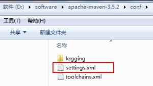

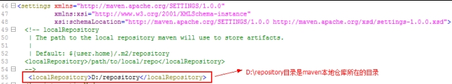

​                     

>   在 MAVE_HOME/conf/settings.xml 文件中配置本地仓库位置（maven
>   的安装目录下）：

打开 settings.xml 文件，配置如下：

**2.2.3 全局 setting 与 用 户 setting**

>   maven 仓库地址、私服等配置信息需要在 setting.xml
>   文件中配置，分为全局配置和用户配置。 在 maven 安装目录下的有
>   conf/setting.xml 文件，此 setting.xml 文件用于 maven 的所有 project

项目，它作为 maven 的全局配置。

如需要个性配置则需要在用户配置中设置，用户配置的 setting.xml
文件默认的位置在：\${user.dir} /.m2/settings.xml 目录中,\${user.dir} 指 windows
中的用户目录。

>   maven 会先找用户配置，如果找到则以用户配置文件为准，否则使用全局配置文件。

>      

​    

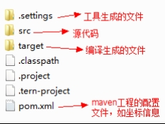

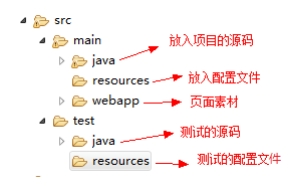

​                     

​                     

>   **2.3 Maven 工程的认识**

**2.3.1 Maven 工程的目录结构**

作为一个 maven 工程，它的 src 目录和 pom.xml 是必备的。 进入 src
目录后，我们发现它里面的目录结构如下：

src/main/java —— 存放项目的. java 文件

src/main/resources —— 存放项目资源文件，如 spring, hibernate 配置文件
src/test/java —— 存放所有单元测试. java 文件，如 JUnit 测试类 src/test/resources
—— 测试资源文件

target —— 项目输出位置，编译后的 class 文件会输出到此目录

pom.xml ——maven 项目核心配置文件

注意：如果是普通的 java 项目，那么就没有 webapp 目录。

**2.3.2 Maven 工程的运行**

进入 maven 工程目录（当前目录有 pom.xml 文件），运行 tomcat:run 命令。

>      

​    

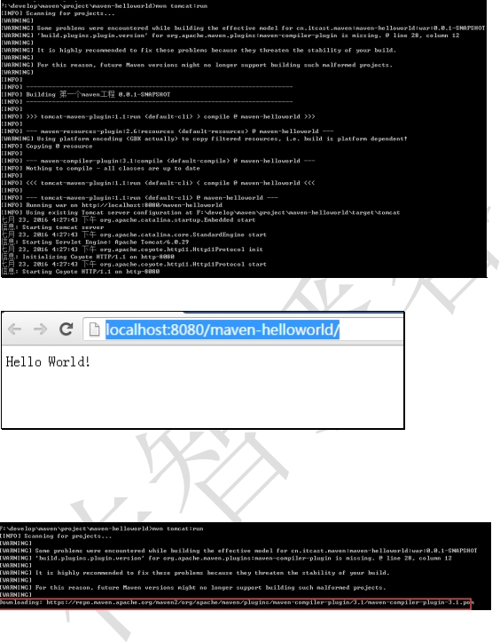

​                     

​                     

根据上边的提示信息，通过浏览器访问： <http://localhost:8080/maven-helloworld/>

**2.3.3 问题处理**

>   如果本地仓库配置错误会报下边的错误

分析：

maven 工程运行先从本地仓库找 jar 包，本地仓库没有再从中央仓库找，上边提示
downloading … 表示 从中央仓库下载 jar，由于本地没有联网，报错。

解决：

在 maven 安装目录的 conf/setting.xml
文件中配置本地仓库，参考“：maven仓库/配置本地仓库章节”。

>      

​    

​                     

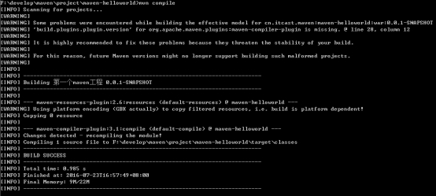

​                     

>   **第3章 Maven 常用命令**

我们可以在 cmd 中通过一系列的 maven 命令来对我们的 maven-helloworld
工程进行编译、测试、运 行、打包、安装、部署。

**3.1.1 compile**

compile 是 maven 工程的编译命令，作用是将 src/main/java 下的文件编译为 class
文件输出到 target 目录下。

cmd 进入命令状态，执行 mvn compile，如下图提示成功：

>   查看 target 目录，class 文件已生成，编译完成。

**3.1.2 test**

test 是 maven 工程的测试命令 mvn test，会执行 src/test/java 下的单元测试类。

cmd 执行 mvn test 执行 src/test/java 下单元测试类，下图为测试结果，运行 1
个测试用例，全部成功。

>      

​    

​                     

​                     

**3.1.3 clean**

clean 是 maven 工程的清理命令，执行 clean 会删除 target 目录及内容。

**3.1.4 package**

package 是 maven 工程的打包命令，对于 java 工程执行 package 打成 jar 包，对于
web 工程打成 war 包。

**3.1.5 install**

install 是 maven 工程的安装命令，执行 install 将 maven 打成 jar 包或 war
包发布到本地仓库。

从运行结果中，可以看出：

当后面的命令执行时，前面的操作过程也都会自动执行，

**3.1.6 Maven 指令的生命周期**

maven
对项目构建过程分为三套相互独立的生命周期，请注意这里说的是“三套”，而且“相互
独立”， 这三套生命周期分别是：

1.  lean Lifecycle 在进行真正的构建之前进行一些清理工作。

2.  efault Lifecycle 构建的核心部分，编译，测试，打包，部署等等。

Site Lifecycle 生成项目报告，站点，发布站点。

**3.1.7 maven 的 概念 模型**

Maven 包含了一个项目对象模型 (Project Object
Model)，一组标准集合，一个项目生命周期(Project Lifecycle)
，一个依赖管理系统(Dependency Management System)，和用来运行定义在生命周期阶段
(phase)中插件(plugin)目标(goal)的逻辑。

>      

​    

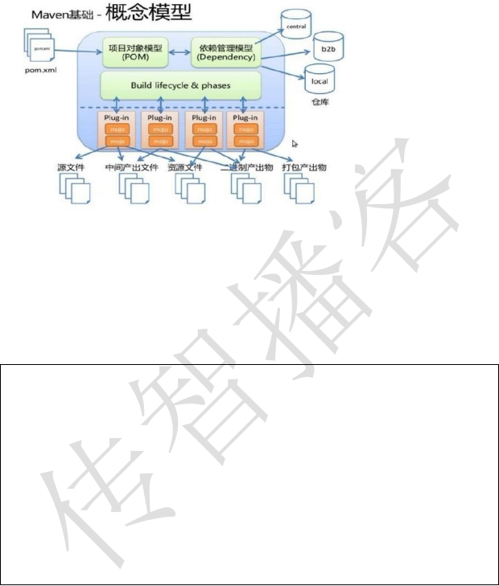

​                     

​                     

项目对象模型 (Project Object Model)

一个 maven 工程都有一个 pom.xml 文件，通过 pom.xml
文件定义项目的坐标、项目依赖、项目信息、 插件目标等。

依赖管理系统(Dependency Management System)

通过 maven 的依赖管理对项目所依赖的 jar 包进行统一管理。

比如：项目依赖 junit4.9，通过在 pom.xml 中定义 junit4.9 的依赖即使用
junit4.9，如下所示是 junit4.9 的依赖定义：

一个项目生命周期(Project Lifecycle)

使用 maven 完成项目的构建，项目构建包括：清理、编译、测试、部署等过程，maven
将这些 过程规范为一个生命周期，如下所示是生命周期的各各阶段：

>      

​    

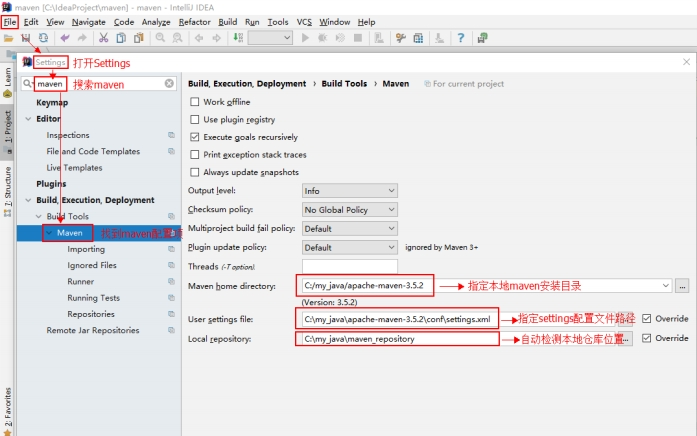

​                     

​                     

maven 通过执行一些简单命令即可实现上边生命周期的各各过程，比如执行 mvn compile
执行编译、 执行 mvn clean 执行清理。

一组标准集合

maven 将整个项目管理过程定义一组标准，比如：通过 maven
构建工程有标准的目录结构，有 标准的生命周期阶段、依赖管理有标准的坐标定义等。

插件(plugin)目标(goal)

maven 管理项目生命周期过程都是基于插件完成的。

>   **3.2 idea 开发 maven 项目**

在实战的环境中，我们都会使用流行的工具来开发项目。

**3.2.1 idea 的 maven 配置**

**3.2.1.1 打开File Settings 配置 maven**

依据图片指示，选择本地 maven 安装目录，指定 maven 安装目录下 conf 文件夹中
settings 配置文件。

>      

​    

​                     

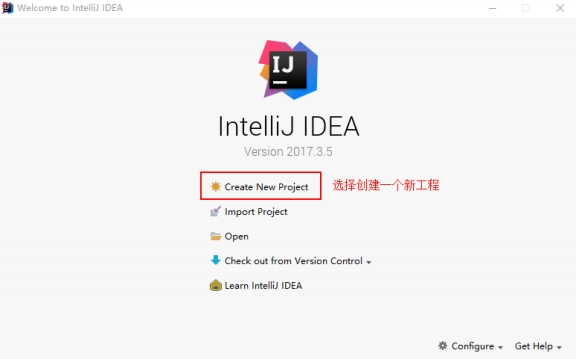

​                     **3.2.2 idea 中
创建一个 maven 的 web 工 程**

打开 idea ，选择创建一个新工程

选择 idea 提供好的 maven 的 web 工程模板

点击 Next 填写项目信息

>      

​    

​                     

传智播客——专注于 Java、.Net 和 Php、网页平面设计工程师的培训

点击 Next，此处不做改动。

点击 Next 选择项目所在目录

>      

​    

​                     

​                     

点击 Finish 后开始创建工程，耐心等待，直到出现如下界面。

>      

​    

​                     

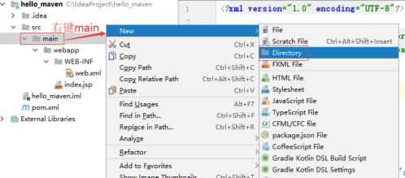

传智播客——专注于 Java、.Net 和 Php、网页平面设计工程师的培训

手动添加 src/main/java 目录，如下图右键 main 文件夹New Directory

创建一个新的文件夹命名为 java

点击 OK 后，在新的文件夹 java 上右键Make Directory asSources Root

>      

​    

​                     

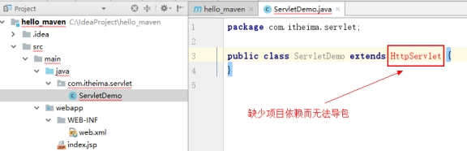

​                     **3.2.2.1 创建一
个 Servlet**

src/java/main 创建了一个 Servlet，但报错

要解决问题，就是要将 servlet-api-xxx.jar 包放进来，作为 maven 工程应当添加
servlet 的坐标，从而 导入它的 jar

**3.2.2.2 在 pom.xml 文件添加 坐标**

直接打开 hello_maven 工程的 pom.xml 文件，再添加坐标

添加 jar 包的坐标时，还可以指定这个 jar 包将来的作用范围。

每个 maven 工程都需要定义本工程的坐标，坐标是 maven 对 jar
包的身份定义，比如：入门程序的 坐标定义如下：

\<!-- 项目名称，定义为组织名+项目名，类似包名--\>

\<groupId\>com.itheima\</groupId\>

\<!-- 模块名称 --\>

\<artifactId\>hello_maven\</artifactId\>

\<!-- 当前项目版本号，snapshot 为快照版本即非正式版本，release 为正式发布版本
--\>

>      

​    

​                     

​                     
\<version\>0.0.1-SNAPSHOT\</version\>

\<packaging \> ：打包类型

>   jar：执行 package 会打成 jar 包

>   war：执行 package 会打成 war 包

pom ：用于 maven 工程的继承，通常父工程设置为 pom

**3.2.2.3 坐标的 来源方 式**

添加依赖需要指定依赖 jar 包的坐标，但是很多情况我们是不知道 jar
包的的坐标，可以通过如下方 式查询：

**3.2.2.3.1 从互联网搜索**

>   [http://search.maven.org/ ](http://search.maven.org/)

>   <http://mvnrepository.com/>

网站搜索示例：

**3.2.3 依赖范围**

A 依赖 B ，需要在 A 的 pom.xml 文件中添加 B
的坐标，添加坐标时需要指定依赖范围，依赖范围包 括：

>      

​    

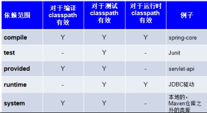

​                     

​                     

compile ：编译范围，指 A 在编译时依赖
B，此范围为默认依赖范围。编译范围的依赖会用在
编译、测试、运行，由于运行时需要所以编译范围的依赖会被打包。

provided：provided 依赖只有在当 JDK 或者一个容器已提供该依赖之后才使用 ，
provided 依 赖在编译和测试时需要，在运行时不需要，比如： servlet api 被 tomcat
容器提供。

runtime ：runtime
依赖在运行和测试系统的时候需要，但在编译的时候不需要。比如：jdbc
的驱动包。由于运行时需要所以 runtime 范围的依赖会被打包。

test：test 范围依赖
在编译和运行时都不需要，它们只有在测试编译和测试运行阶段可用， 比如：junit
。由于运行时不需要所以 test 范围依赖不会被打包。

system：system 范围依赖与 provided 类似，但是你必须显式的提供一个对于本地系统中
JAR 文件的路径，需要指定 systemPath 磁盘路径，system 依赖不推荐使用。

在 maven-web 工程中测试各各 scop。

测试总结：

-   默认引入 的 jar 包 ------- compile 【默认范围 可以不写】（编译、测试、运行
    都有效 ） servlet-api 、jsp-api ------- provided （编译、测试 有效，
    运行时无效 防止和 tomcat 下 jar 冲突） jdbc 驱动 jar 包 ---- runtime
    （测试、运行 有效 ）

-   junit ----- test （测试有效）

依赖范围由强到弱的顺序是：compile\>provided\>runtime\>test

>      

​    

​                     

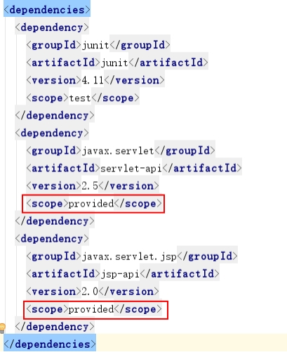

**3.2.4
项目中添加的 坐标**

**3.2.5 设置 jdk 编 译版 本**

本教程使用 jdk1.8，需要设置编译版本为 1.8，这里需要使用 maven 的插件来设置： 在
pom.xml 中加入：

>      

​    

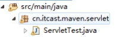

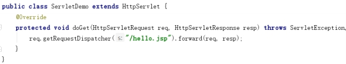

​                     

**3.2.6 编写 servlet**

在 src/main/java 中创建 ServletTest

内容如下

**3.2.7 编写 jsp**

>      

​    

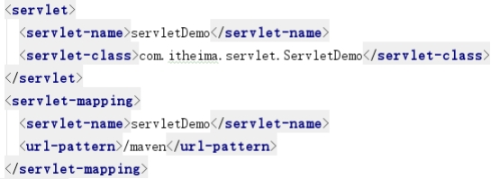

​                     

​                     **3.2.8 在 web.xml
中配 置 servlet 访问路径**

**3.2.9 添加 tomcat7 插件**

在 pom 文件中添加如下内容

此时点击 idea 最右侧 Maven Projects，

就可以看到我们新添加的 tomcat7 插件

双击 tomcat7 插件下 tomcat7:run 命令直接运行项目

>      

​    

也可以直接点击如图按钮，手动输入 tomc7:run 命令运行项目

点击后弹出如下图窗口

>      

​    

​                     

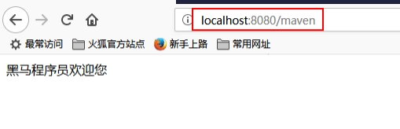

**3.2.10 运行结果**

**第4章 maven 工程运行调试 4.1 端口占用处理**

重新执行 tomcat:run 命令重启工程，重启之前需手动停止 tomcat ，否则报下边的错误：

**4.2 断点调试**

点击如图所示选项

在弹出框中点击如图加号按钮找到 maven 选项

在弹出窗口中填写如下信息

>      

​    

​                     

​                     

完成后先 Apply 再 OK 结束配置后，可以在主界面找到我们刚才配置的操作名称。

如上图红框选中的两个按钮，左侧是正常启动，右侧是 debug 启动。

>   **第5章 总结**

**5.1 maven 仓库**

1.  maven 仓库的类型有哪些？

2.  maven 工程查找仓库的流程是什么？

3.  本地仓库如何配置？

**5.2 常用的 maven 命令**

常用 的 maven 命令包括：

compile ：编译

clean：清理

test：测试

package：打包

install：安装

**5.3 坐标定义**

在 pom.xml 中定义坐标，内容包括：groupId、artifactId 、version ，详细内容如下：

\<!-- 项目名称，定义为组织名+项目名，类似包名--\>
\<groupId\>cn.itcast.maven\</groupId\>

\<!-- 模块名称 --\>

>      

​    

​                     

​                     
\<artifactId\>maven-first\</artifactId\>

\<!-- 当前项目版本号，snapshot 为快照版本即非正式版本，release 为正式发布版本
--\> \<version\>0.0.1-SNAPSHOT\</version\>

\<packaging \> ：打包类型

>   jar：执行 package 会打成 jar 包

>   war：执行 package 会打成 war 包

>   pom ：用于 maven 工程的继承，通常父工程设置为 pom

**5.4 pom 基本配置**

pom.xml 是 Maven 项目的核心配置文件，位于每个工程的根目录，基本配置如下：
\<project \> ：文件的根节点 .

\<modelversion \> ： pom.xml 使用的对象模型版本

\<groupId \> ：项目名称，一般写项目的域名

\<artifactId \> ：模块名称，子项目名或模块名称

\<version \> ：产品的版本号 .

>   \<packaging \> ：打包类型，一般有 jar、war、pom 等

\<name \> ：项目的显示名，常用于 Maven 生成的文档。

\<description \> ：项目描述，常用于 Maven 生成的文档

\<dependencies\> ：项目依赖构件配置，配置项目依赖构件的坐标

\<build\> ：项目构建配置，配置编译、运行插件等。

>      

​    
